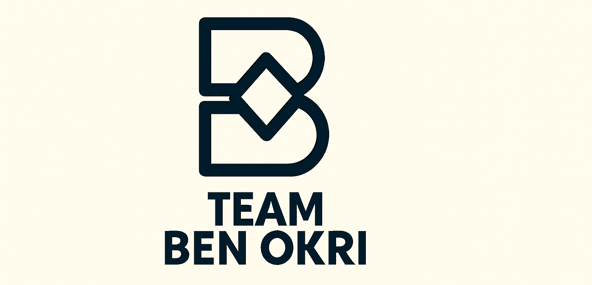

# 👋 Welcome to Team Ben Okri

**Team Ben Okri** is a collaborative group of five data scientists and machine learning enthusiasts passionate about building impactful, data-driven solutions. Inspired by the creativity of Nigerian writer **Ben Okri**, we bring together imagination, teamwork, and technical expertise to solve real-world problems.

---

## 🌍 What We Do
- 📊 **Data Analytics & Visualization** – uncover insights from raw data  
- 🤖 **Machine Learning** – predictive modeling and applied AI solutions  
- 🏥 **Healthcare & Socioeconomic Projects** – applying ML for social good  
- 📡 **Telecom & Sustainability Applications** – solving local and global challenges  

---

## 🚀 Our Mission
To harness the power of data and machine learning to create **practical, reproducible, and socially impactful solutions**, especially within Africa and beyond.

---

## 📂 Featured Projects
- 🔮 *Predicting Customer Churn in Nigeria’s Telecom Industry*  
- 🏫 *School Dropout Risk Prediction using Socioeconomic and Health Indicators*  
- 💊 *Healthcare Analytics for Better Outcomes*  

---

## 👥 Our Team
We are a team of 5 innovators working together to explore, learn, and apply machine learning in meaningful ways.  

---

## 📫 Connect With Us
Stay tuned as we release our projects, share knowledge, and collaborate with the broader data science community.  

---
✨ *“Stories can conquer fear, you know. They can make the heart bigger.” – Ben Okri*  

